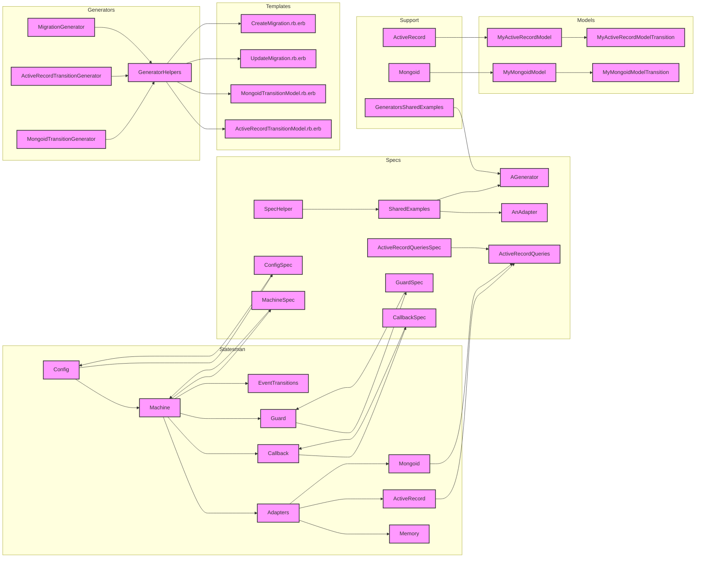

**Explanation:**

* **Statesman:** The core library for managing state machines.
    * **Config:** Defines the storage adapter to use for transitions.
    * **Machine:** The main class for defining state machines.
    * **Adapters:** Provides different storage mechanisms for transitions (Memory, ActiveRecord, Mongoid).
    * **Callback:** Represents a callback function that can be triggered during state transitions.
    * **Guard:** Represents a guard condition that must be met before a transition can occur.
    * **EventTransitions:** Allows defining transitions triggered by specific events.
* **Generators:** Provides tools for generating code related to state machines.
    * **MigrationGenerator:** Generates migrations for adding Statesman attributes to existing transition models.
    * **ActiveRecordTransitionGenerator:** Generates an ActiveRecord-based transition model.
    * **MongoidTransitionGenerator:** Generates a Mongoid-based transition model.
    * **GeneratorHelpers:** Provides helper methods for generators.
* **Models:** Represents the data models used in the application.
    * **MyMongoidModel:** A Mongoid model with a state machine.
    * **MyMongoidModelTransition:** A Mongoid model representing transitions for `MyMongoidModel`.
    * **MyActiveRecordModel:** An ActiveRecord model with a state machine.
    * **MyActiveRecordModelTransition:** An ActiveRecord model representing transitions for `MyActiveRecordModel`.
* **Specs:** Contains unit tests for the codebase.
    * **SpecHelper:** Sets up the testing environment.
    * **SharedExamples:** Defines shared examples for testing adapters and generators.
    * **ActiveRecordQueriesSpec:** Tests the `ActiveRecordQueries` module for querying models based on their state.
    * **MachineSpec:** Tests the `Machine` class.
    * **CallbackSpec:** Tests the `Callback` class.
    * **GuardSpec:** Tests the `Guard` class.
    * **ConfigSpec:** Tests the `Config` class.
* **Support:** Provides helper files for testing.
    * **ActiveRecord:** Sets up the ActiveRecord environment for testing.
    * **Mongoid:** Sets up the Mongoid environment for testing.
    * **GeneratorsSharedExamples:** Defines shared examples for testing generators.
* **Templates:** Contains ERB templates used by generators.
    * **ActiveRecordTransitionModel.rb.erb:** Template for generating an ActiveRecord transition model.
    * **MongoidTransitionModel.rb.erb:** Template for generating a Mongoid transition model.
    * **UpdateMigration.rb.erb:** Template for generating a migration to update an existing transition model.
    * **CreateMigration.rb.erb:** Template for generating a migration to create a new transition model.

**Key Relationships:**

* **Machine** depends on **Adapters**, **Callback**, **Guard**, and **EventTransitions**.
* **Generators** depend on **GeneratorHelpers**.
* **Models** depend on **Statesman** for state machine functionality.
* **Specs** depend on **Statesman**, **Models**, and **Support** for testing.
* **Templates** are used by **Generators** to generate code.

This diagram provides a high-level overview of the codebase's architecture, highlighting the key components and their relationships. It can be used to understand the overall structure of the codebase and how different parts interact with each other.
