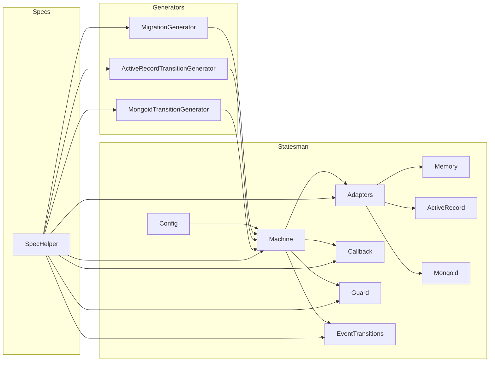

**Legend:**

* **Statesman:** The core module of the codebase, responsible for defining state machines and managing transitions.
    * **Config:**  Handles configuration options for the state machine, including the storage adapter.
    * **Machine:**  The main class for defining state machines, including states, transitions, and callbacks.
    * **Adapters:**  Provides different storage mechanisms for transition history.
        * **Memory:**  Stores transitions in memory, suitable for testing or simple applications.
        * **ActiveRecord:**  Stores transitions in an ActiveRecord database.
        * **Mongoid:**  Stores transitions in a MongoDB database.
    * **Callback:**  Represents a callback function that can be triggered before, after, or during a transition.
    * **Guard:**  A special type of callback that acts as a condition for a transition.
    * **EventTransitions:**  Allows defining transitions triggered by specific events.
* **Generators:**  Provides Rails generators for creating state machine models and migrations.
    * **MigrationGenerator:**  Generates a migration to add Statesman attributes to an existing transition model.
    * **ActiveRecordTransitionGenerator:**  Generates an ActiveRecord-based transition model.
    * **MongoidTransitionGenerator:**  Generates a Mongoid-based transition model.
* **Specs:**  Contains unit tests for the Statesman module and its components.
    * **SpecHelper:**  Provides common setup and helper methods for the tests.

**Key Relationships:**

* **Machine** depends on **Adapters** for storing transition history.
* **Generators** use **Machine** to create state machine models and migrations.
* **Specs** test the functionality of **Statesman**, **Adapters**, **Callback**, **Guard**, and **EventTransitions**.

**Overall Architecture:**

The codebase is organized around the **Statesman** module, which provides the core functionality for defining and managing state machines. The **Adapters** submodule offers different storage options for transition history, allowing flexibility in how the state machine is implemented. The **Generators** submodule provides tools for creating state machine models and migrations, simplifying the integration of Statesman into Rails applications. The **Specs** submodule ensures the correctness and robustness of the codebase through comprehensive unit tests.