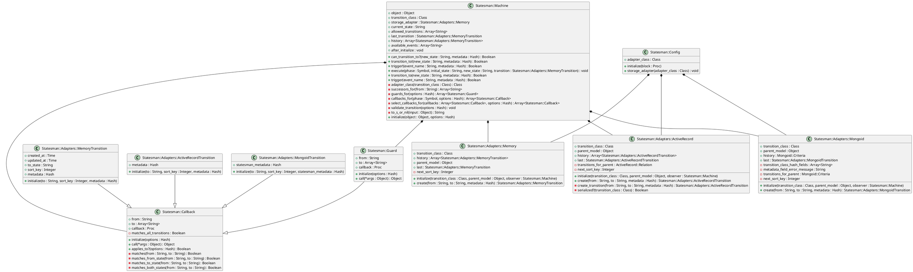

```plantuml
@startuml
class Statesman::Adapters::MemoryTransition {
  + created_at : Time
  + updated_at : Time
  + to_state : String
  + sort_key : Integer
  + metadata : Hash
  + initialize(to : String, sort_key : Integer, metadata : Hash)
}

class Statesman::Adapters::Memory {
  + transition_class : Class
  + history : Array<Statesman::Adapters::MemoryTransition>
  + parent_model : Object
  + initialize(transition_class : Class, parent_model : Object, observer : Statesman::Machine)
  + create(from : String, to : String, metadata : Hash) : Statesman::Adapters::MemoryTransition
  + last : Statesman::Adapters::MemoryTransition
  - next_sort_key : Integer
}

class Statesman::Adapters::ActiveRecordTransition {
  + metadata : Hash
  + initialize(to : String, sort_key : Integer, metadata : Hash)
}

class Statesman::Adapters::ActiveRecord {
  + transition_class : Class
  + parent_model : Object
  + initialize(transition_class : Class, parent_model : Object, observer : Statesman::Machine)
  + create(from : String, to : String, metadata : Hash) : Statesman::Adapters::ActiveRecordTransition
  + history : Array<Statesman::Adapters::ActiveRecordTransition>
  + last : Statesman::Adapters::ActiveRecordTransition
  - create_transition(from : String, to : String, metadata : Hash) : Statesman::Adapters::ActiveRecordTransition
  - transitions_for_parent : ActiveRecord::Relation
  - next_sort_key : Integer
  - serialized?(transition_class : Class) : Boolean
}

class Statesman::Adapters::MongoidTransition {
  + statesman_metadata : Hash
  + initialize(to : String, sort_key : Integer, statesman_metadata : Hash)
}

class Statesman::Adapters::Mongoid {
  + transition_class : Class
  + parent_model : Object
  + initialize(transition_class : Class, parent_model : Object, observer : Statesman::Machine)
  + create(from : String, to : String, metadata : Hash) : Statesman::Adapters::MongoidTransition
  + history : Mongoid::Criteria
  + last : Statesman::Adapters::MongoidTransition
  - transition_class_hash_fields : Array<String>
  - metadata_field_error_message : String
  - transitions_for_parent : Mongoid::Criteria
  - next_sort_key : Integer
}

class Statesman::Callback {
  + from : String
  + to : Array<String>
  + callback : Proc
  + initialize(options : Hash)
  + call(*args : Object) : Object
  + applies_to?(options : Hash) : Boolean
  - matches(from : String, to : String) : Boolean
  - matches_all_transitions : Boolean
  - matches_from_state(from : String, to : String) : Boolean
  - matches_to_state(from : String, to : String) : Boolean
  - matches_both_states(from : String, to : String) : Boolean
}

class Statesman::Guard {
  + from : String
  + to : Array<String>
  + callback : Proc
  + initialize(options : Hash)
  + call(*args : Object) : Object
}

class Statesman::Machine {
  + object : Object
  + transition_class : Class
  + storage_adapter : Statesman::Adapters::Memory
  + current_state : String
  + allowed_transitions : Array<String>
  + last_transition : Statesman::Adapters::MemoryTransition
  + can_transition_to?(new_state : String, metadata : Hash) : Boolean
  + history : Array<Statesman::Adapters::MemoryTransition>
  + transition_to!(new_state : String, metadata : Hash) : Boolean
  + trigger!(event_name : String, metadata : Hash) : Boolean
  + execute(phase : Symbol, initial_state : String, new_state : String, transition : Statesman::Adapters::MemoryTransition) : void
  + transition_to(new_state : String, metadata : Hash) : Boolean
  + trigger(event_name : String, metadata : Hash) : Boolean
  + available_events : Array<String>
  - adapter_class(transition_class : Class) : Class
  - successors_for(from : String) : Array<String>
  - guards_for(options : Hash) : Array<Statesman::Guard>
  - callbacks_for(phase : Symbol, options : Hash) : Array<Statesman::Callback>
  - select_callbacks_for(callbacks : Array<Statesman::Callback>, options : Hash) : Array<Statesman::Callback>
  - validate_transition(options : Hash) : void
  - to_s_or_nil(input : Object) : String
  + initialize(object : Object, options : Hash)
  + after_initialize : void
}

class Statesman::Config {
  + adapter_class : Class
  + initialize(block : Proc)
  + storage_adapter(adapter_class : Class) : void
}

Statesman::Adapters::MemoryTransition --|> Statesman::Callback
Statesman::Adapters::ActiveRecordTransition --|> Statesman::Callback
Statesman::Adapters::MongoidTransition --|> Statesman::Callback
Statesman::Guard --|> Statesman::Callback
Statesman::Machine *-- Statesman::Adapters::Memory
Statesman::Machine *-- Statesman::Adapters::ActiveRecord
Statesman::Machine *-- Statesman::Adapters::Mongoid
Statesman::Machine *-- Statesman::Callback
Statesman::Machine *-- Statesman::Guard
Statesman::Config *-- Statesman::Adapters::Memory
Statesman::Config *-- Statesman::Adapters::ActiveRecord
Statesman::Config *-- Statesman::Adapters::Mongoid
@enduml
```